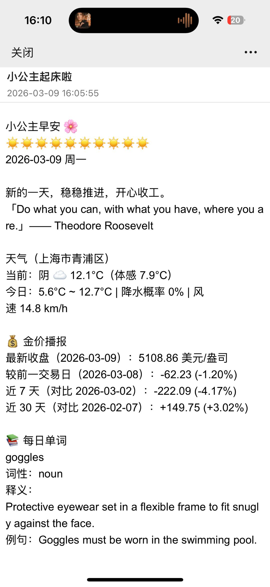

# MorningCall 🌸

每日早安消息推送机器人。通过 GitHub Actions 每天定时收集定制化的资讯（金价、新闻等）、天气、每日单词等内容，并通过 QQ 邮箱 SMTP 温暖地准时送达给小公主！

## 效果展示

## 🌟 推送内容概览

脚本运行后，会自动拼装以下模块并发送：

- **🌸 专属早安问候**：定制的早安问候语，附加一条励志的英语名人名言（工作日/周末双模板）。
- **⛅ 实时天气播报**：获取当地天气（默认上海市青浦区），包含当前气温、体感、最高/最低温、风速、降水概率，并智能配上对应的天气表情 🌧️☀️。
- **💰 国际金价追踪**：提供最新的国际金价（`XAU/USD`），并贴心计算出与昨日、近 7 天、近 30 天的价格对比和涨跌幅。
- **📚 雅思每日单词**：自动从线上词库中抽取一个对应的单词，并调用词典接口展示其**词性**、**全英释义**和**使用例句**。
- **💻/💹 国际科技与财经热议榜**：汇总全球当前最新、热度最高的 Top 3 科技（AI/大模型/半导体）及财经领域新闻标题。（周末自动隐藏让你好好休息）

## 🛠️ 完善的降级机制

不用担心缺少某个 API 密钥导致崩溃。脚本内置了优雅的容错处理：
当未配置（或配置错误）对应的密钥如新闻 (`NEWS_API_KEY`) 或金价 (`TWELVE_DATA_API_KEY`) 时，涉及的特定模块将在推送的邮件中自动隐藏，而不影响其他内容的正常发送和定时推送。

## 🚀 部署与运行

本项目依靠 **GitHub Actions** 进行零成本、自动化托管运行。

### Github Secrets 密钥配置项
如需开启对应的推送模块模块，需前往项目的 `Settings` -> `Secrets and variables` -> `Actions` 下添加：

- 发送邮件（必填）：
  - `MAIL_USERNAME`: 您用来发信的 QQ 邮箱地址。
  - `MAIL_PASSWORD`: 您的 QQ 邮箱 SMTP 授权码。
  
- 高级资讯定制（选填）：
  - `TWELVE_DATA_API_KEY`: 来自 Twelve Data 的密钥，用于获取金价。
  - `NEWS_API_KEY`: 来自 NewsAPI 的密钥，用于获取各领域国际新闻。

## ❤️ 赞助与支持

如果您觉得这个每日早安推送机器人对您有帮助，让小公主每天都开开心心，欢迎扫码打赏（推荐使用微信支付）支持开发和维护：

